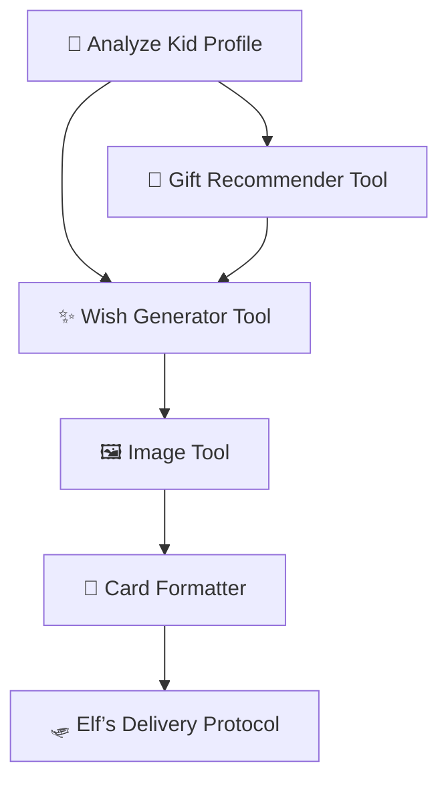

# 🎄 Santa Scale Challenge

### **AI Orchestration & Agentic Deployment on Nebius Infrastructure**

Welcome to the **Santa Scale Challenge** — a reference implementation showing how to orchestrate LLMs, agentic workflows, and distributed batch jobs using **Nebius GPU infrastructure**, **SkyPilot**, and **MLflow**.

This monorepo contains:

* A **local prototype** for experimenting with LLMs & image models
* A production-style **Santa Agent** for generating personalized gift cards
* Self-hosted **LLM and image generation services**
* Infrastructure files for **SkyPilot**, **MLflow**, and deployment

It is the companion repo for the *Santa Scale Challenge Webinar*.

---

# 🗂️ Repository Structure

```
santa-scale-challenge/
├── prototype/           # Jupyter-first prototype & experiments
├── santa_agent/         # Production batch pipeline (agentic workflow)
├── models/              # Self-hosted LLM & image generation servers
├── infra/               # SkyPilot, MLflow, Terraform
└── demos/               # CLI demos and slide code snippets
```

---

# 🚀 Quickstart

### 1. Clone

```bash
git clone https://github.com/<your-org>/santa-scale-challenge
cd santa-scale-challenge
```

### 2. Set up environment with uv

This project uses **[uv](https://github.com/astral-sh/uv)** as the preferred Python package manager for fast, reliable dependency management.

#### Install uv

**macOS/Linux:**
```bash
curl -LsSf https://astral.sh/uv/install.sh | sh
```

#### Create virtual environment and install dependencies

```bash
# Create virtual environment (uv will use Python 3.10+ if available)
uv venv
source .venv/bin/activate

# Install project dependencies
uv pip install -e .

# Install development dependencies (optional, for Jupyter, testing, etc.)
uv pip install -e ".[dev]"
```

### 3. Run the Jupyter notebook prototype

```bash
# Start Jupyter notebook
jupyter notebook prototype/gift_generation.ipynb
```

Or run a local prototype script (when available):

```bash
python prototype/scripts/generate_card_openai.py
```

### 4. Configure LLM service (optional)

Before running the prototype, you may need to configure your LLM service endpoint. The notebook uses an OpenAI-compatible API.

**Option A: Use local vLLM server**

```bash
cd models/llm
bash start_vllm.sh
```

Then update the `LLMClient` in the notebook to point to `localhost:8000`.

**Option B: Use OpenAI API**

Update the `LLMClient` initialization in the notebook to use OpenAI's API endpoint.

### 5. Launch self-hosted LLM (vLLM) locally

```bash
cd models/llm
bash start_vllm.sh
```

### 6. Run the Santa Agent on one kid

```bash
python santa_agent/orchestrator.py --kid sample_kid.json
```

### 7. Run distributed batch job with SkyPilot

```bash
sky launch -c santa-batch infra/sky/santa_batch.yaml
```

---

# 🎁 Project Overview

## ❄️ 1. Santa’s Challenge

Generate **2 billion personalized gift cards in 30 days**:

* Gift recommendation
* Personalized wish
* Unique illustration
* Final HTML/PDF card

A single workflow takes **~5 seconds**.
Sequential processing would take **317+ years**.

Santa needs:

* an **agentic workflow**,
* a **self-hosted LLM**,
* **distributed execution**, and
* **strong observability**.

This repo implements all of the above.

---

# 🤖 2. Agentic Workflow

The Santa Agent pipeline:



Each stage is implemented under `santa_agent/tools/` and orchestrated by `santa_agent/orchestrator.py`.

---

# 📦 3. Self-Hosted LLM and Image Models

Under `models/`:

* **vLLM** server for gift reasoning & wish generation
* **Stable Diffusion / Flux / Recraft proxy** for image generation

Clients live under `models/clients/`.

We use HTTP endpoints to keep batch workers lightweight.

---

# 🔧 4. Santa Agent (Batch Pipeline)

The **Santa Agent** runs in distributed mode via SkyPilot.

### Worker responsibilities:

1. Load KidProfile from DB
2. Call self-hosted LLM
3. Generate image
4. Format final gift card
5. Upload everything to S3
6. Log metrics to MLflow

Run locally:

```bash
python santa_agent/worker.py --batch data/kids.json
```

---

# ☁️ 5. Distributed Processing with SkyPilot

SkyPilot automatically:

* provisions Nebius compute
* executes the batch worker
* handles retries
* autoscaling
* provides logs for each node

Config:

```
infra/sky/santa_batch.yaml
```

Run:

```bash
sky launch -c santa infra/sky/santa_batch.yaml
```

---

# 📊 6. Observability & MLflow

Under `infra/mlflow/`:

* MLflow tracks

  * model version
  * latency
  * image artifacts
  * cost estimates
  * final card output

* Perfect for model comparison and evaluation

* Used in the *Elf Evaluation Challenge* during the webinar

Start MLflow locally:

```bash
mlflow ui
```

---

# 🧱 7. Data Models (Simplified)

### KidProfile

```python
id: str
name: str
age: int
wishlist: List[str]
```

### GiftRecommendation

```python
id: str
kid_id: str
gifts: List[str]
rationale: str
model_version: str
```

### Wish

```python
id: str
kid_id: str
text: str
model_version: str
```

### CardImage

```python
id: str
kid_id: str
image_url: str
model_version: str
```

### GiftCard

```python
id: str
kid_id: str
recommendation_id: str
wish_id: str
image_id: str
rendered_url: str
status: str
```

---

# 🧪 8. Local Prototyping

Use `prototype/` to:

* experiment with multiple LLMs
* compare image generation tools
* log runs in MLflow
* estimate cost & latency

This folder is intentionally messy — a sandbox for exploration.

## Working with the Jupyter Notebook

The main prototyping notebook is `prototype/gift_generation.ipynb`. It demonstrates:

1. **Gift Recommendation Generation** - Using LLM to recommend gifts based on kid profiles
2. **Wish Generation** - Creating personalized holiday wishes
3. **Image Generation** - Placeholder for card images (ready for integration with image services)

To get started:

```bash
# Make sure you have Jupyter installed (included in [dev] dependencies)
uv pip install -e ".[dev]"

# Launch Jupyter
jupyter notebook prototype/gift_generation.ipynb
```

The notebook includes sample kid profiles and can be easily extended to test different LLM models, prompts, and image generation services.

---

# 🌐 9. Self-Hosted LLM Deployment

Examples under:

```
models/llm/
models/image/
```

Deploy on Nebius GPU instances:

```bash
bash start_vllm.sh
```

Configure your SkyPilot jobs to query this endpoint.

---

# 🧯 10. Troubleshooting

## Environment Setup Issues

* **uv not found?** Make sure uv is installed and in your PATH. Try `uv --version` to verify.
* **Python version issues?** uv will automatically use Python 3.10+ if available. Install it via `pyenv` or your system package manager.
* **Import errors?** Make sure you've activated the virtual environment: `source .venv/bin/activate` (or `.venv\Scripts\activate` on Windows)

## Runtime Issues

* **vLLM too slow?** Increase `tensor-parallel-size` or GPU type
* **Workers crash?** Check SkyPilot logs + MLflow traces
* **Image generation throttled?** Switch from API to local SD
* **High cost?** Enable request batching in vLLM
* **LLM connection errors?** Verify your LLM service is running and the host/port in the notebook matches your service configuration

---

# ❤️ Contributing

PRs are welcome — after all, Santa needs all the help he can get.

---

# 🎅 License

MIT — use freely for workshops, training, and holiday-themed AI adventures.

---

If you'd like, I can also generate:

📄 A CONTRIBUTING.md
📦 A `docker-compose.yaml` for local full-stack simulation
🧠 A “North Pole Architecture Diagram”
🧪 End-to-end test scripts
🔥 A template `.env` file with all configuration keys

Just tell me!
